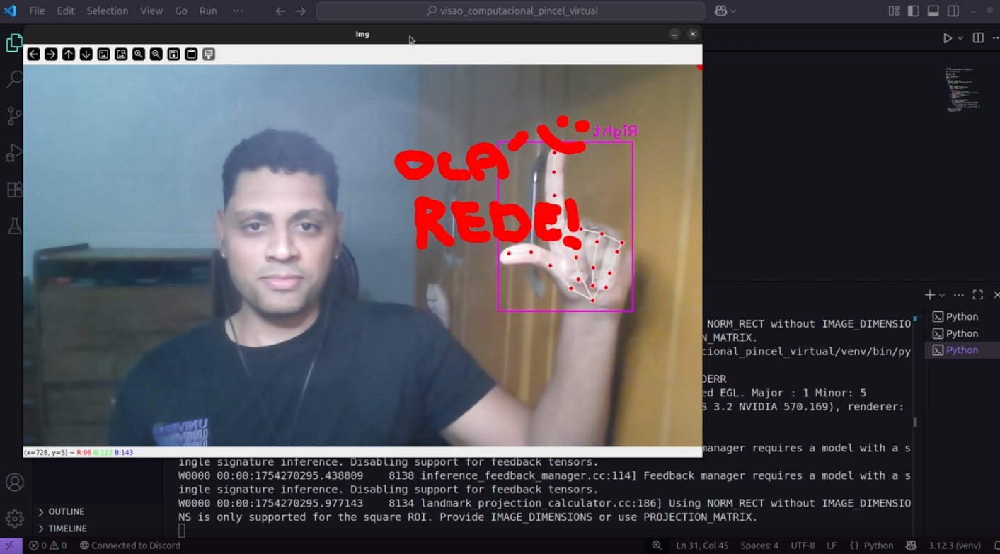

# O que é este projeto?

Este é um projeto em **Python** com foco em **Visão Computacional**, que permite desenhar na tela com os dedos, utilizando a câmera e a detecção de mãos via `cvzone`.

---

# Bibliotecas utilizadas:

- `opencv-python`: para capturar e processar o vídeo da webcam.
- `cvzone`: para detectar mãos e identificar dedos levantados de forma simples e precisa. (Utiliza o MediaPipe internamente em alguns módulos).

---

# O que esse código faz?

- Ativa a webcam e detecta até duas mãos em tempo real.
- Desenha círculos e linhas com base no movimento do dedo indicador.
- Funciona da seguinte forma:
  - **1 dedo levantado**: desenha no ponto detectado.
  - **3 dedos levantados**: apaga o desenho atual.
  - **Outros casos**: pausa o desenho (permite separar traços).
- O desenho é espelhado horizontalmente para facilitar a interação.

---

# Como usar:

### 1. Certifique-se de ter o Python instalado  
Versão utilizada: Python 3.12.3

---

### 2. Crie um ambiente virtual (recomendado)

**Windows:**

```bash
python -m venv venv
venv\Scripts\activate
```

**Linux/MacOS:**

```bash
python3 -m venv venv
source venv/bin/activate
```

---

### 3. Instale as dependências:

```bash
pip install -r requirements.txt
```

---

### 4. Execute o programa:

Abra sua IDE (como VS Code, PyCharm, Thonny ou outra de sua preferência), carregue o arquivo `main.py` e execute o código normalmente.

Ou, se preferir usar o terminal:

```bash
python main.py
```

---

# Observações:

- Pressione **ESC** para encerrar o programa.
- Certifique-se de estar em um ambiente bem iluminado para melhor detecção das mãos.
- O código usa a estrutura do `cvzone.HandTrackingModule`, que encapsula o MediaPipe.

---

# Demonstração

